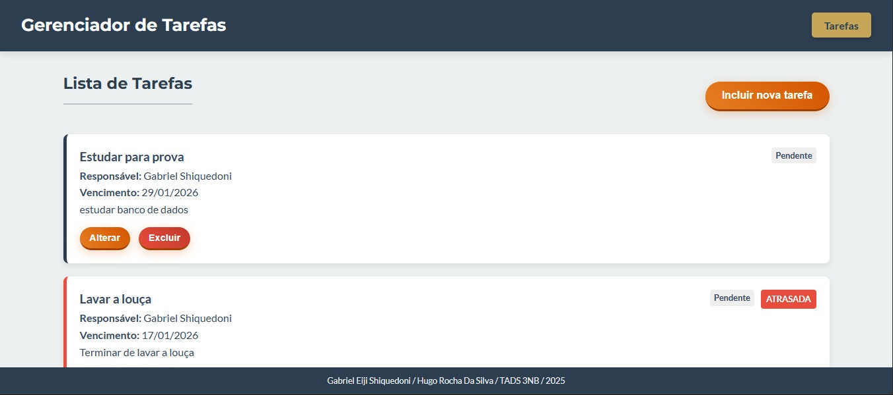
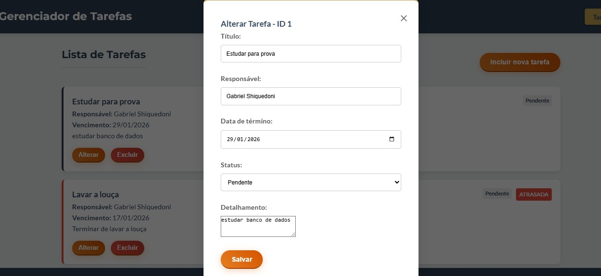

# ✅ TaskManager - Gerenciador de Tarefas Full-Stack

Sistema robusto para gestão de tarefas diárias com controle de status e prazos. Desenvolvido com foco em **Arquitetura em Camadas (Service Layer)** e boas práticas de REST API.

> **Projeto Acadêmico:** Desenvolvido durante a graduação em Análise e Desenvolvimento de Sistemas.

## 📸 Visão do Projeto
Interface limpa e responsiva, com feedback visual imediato do status das tarefas.

| **Dashboard (Desktop)** | **Edição & Status** |
|:---:|:---:|
|  |  |

---

## 🚀 Diferenciais Técnicos
Este não é apenas um CRUD simples. O projeto foi estruturado seguindo padrões de mercado:

* 🏗️ **Arquitetura em Camadas:** Separação clara entre `Controller` (Requisições), `Service` (Regras de Negócio) e `Repository` (Dados).
* 🛡️ **Tipagem Forte com Enums:** O status das tarefas (`PENDENTE`, `EM_ANDAMENTO`, `CONCLUIDA`) é controlado via Enum no Java para garantir integridade dos dados.
* 💉 **Injeção de Dependência:** Uso de injeção via construtor para facilitar testes e manutenção.
* 🎨 **Feedback Visual:** O Front-end reage dinamicamente ao status vindo da API, alterando cores e ícones (✅, ⏳).

## 🛠️ Tecnologias Utilizadas

**Back-End:**
* **Java 17** & **Spring Boot**
* **Spring Data JPA** (Hibernate)
* **Validation API** (Jakarta Validation)
* **H2 Database** (Banco em memória para desenvolvimento rápido)

**Front-End:**
* **JavaScript (Vanilla)**: Consumo de API REST com `fetch`.
* **CSS3**: Estilização responsiva e visualização de status.
* **HTML5**: Estrutura semântica.

## ⚙️ Funcionalidades
* ✨ **CRUD Completo:** Criar, Ler, Atualizar e Excluir tarefas.
* 🚦 **Gestão de Status:** Fluxo de trabalho (Pendente -> Em Andamento -> Concluída).
* 📅 **Controle de Prazos:** Identificação visual automática de tarefas atrasadas.
* 📱 **100% Responsivo:** Layout adaptável para desktop e mobile.

## 🔧 Como executar
1.  **Clone o repositório:** `git clone [LINK-DO-SEU-REPO-AQUI]`
2.  **Rode o Back-end:** Execute a classe `GerenciadorDeTarefasFinalApplication.java`.
3.  **Acesse:** Abra `http://localhost:8080` no seu navegador.

---
## 👨‍💻 Autores
* Gabriel Eiji Shiquedoni [(LinkedIn)](https://www.linkedin.com/in/gabriel-shiquedoni/)
* Hugo Rocha Da Silva
